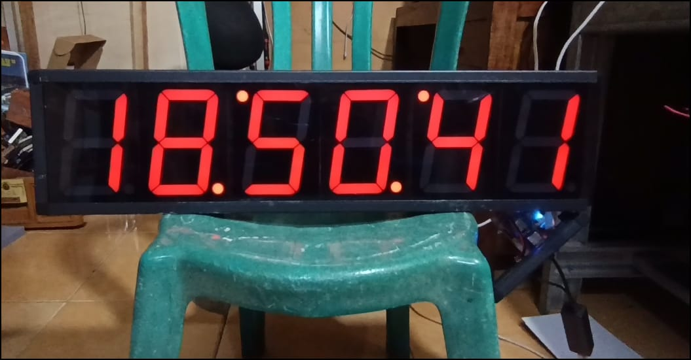

# Jam Digital NTP 6-Digit (High Precision)

Proyek jam digital berbasis mikrokontroler yang mengambil data waktu dari server NTP melalui koneksi kabel (Ethernet) untuk stabilitas maksimum. Menampilkan waktu dalam format **HH:MM:SS** menggunakan 7-segment besar dengan sistem driver shift register 4094.

---

## 📺 Demo Video & Dokumentasi Visual

Berikut adalah dokumentasi operasional perangkat:

### Video Operasional
[](https://www.youtube.com/watch?v=ID_VIDEO_ANDA)
*Klik gambar di atas untuk memutar video demo.*

### Foto Perangkat

*Gambar 1: Unit display jam 6 digit industrial.*

---

## 🌟 Fitur Utama
* **Koneksi LAN (Ethernet)**: Menggunakan modul W5500 untuk konektivitas jaringan yang sangat stabil.
* **Akurasi Tinggi**: Sinkronisasi otomatis ke server NTP (`id.pool.ntp.org`).
* **Driver 4094**: Menggunakan IC Shift Register 4094 untuk kendali display 6-digit.
* **Tampilan 6-Digit**: Format Jam, Menit, dan Detik (HH:MM:SS).

## 🛠️ Komponen Utama
1. **Mikrokontroler**: Wemos D1 Mini (ESP8266).
2. **Modul Ethernet**: Wiznet W5500 (Komunikasi SPI).
3. **Display Driver**: IC 4094 (Shift Register).
4. **Display**: 6-Digit LED 7-Segment ukuran besar.

---

## 🔌 Konfigurasi Pin

### 1. Wemos D1 Mini ke W5500 (SPI)
| W5500 | Wemos D1 Mini | Deskripsi |
| :--- | :--- | :--- |
| **VCC** | 3.3V | Power |
| **GND** | GND | Ground |
| **SCS (SS)** | D2 (GPIO4) | Chip Select |
| **MOSI** | D7 (GPIO13) | Master Out Slave In |
| **MISO** | D6 (GPIO12) | Master In Slave Out |
| **SCLK** | D5 (GPIO14) | Clock |

### 2. Wemos D1 Mini ke Driver 4094
| Driver 4094 | Wemos D1 Mini | Deskripsi |
| :--- | :--- | :--- |
| **DATA** | D1 (GPIO5) | Data Input |
| **STR (Strobe)** | D3 (GPIO0) | Latch/Strobe |
| **CLK (Clock)** | D4 (GPIO2) | Shift Clock |

---

## 🚀 Instalasi Library
Pastikan library berikut terinstal di Arduino IDE:
* `Ethernet` (by Arduino) - Mendukung chip W5500.
* `NTPClient` (by Fabrice Weinberg).

## 💻 Contoh Implementasi Kode (Snippet)
```cpp
#include <SPI.h>
#include <Ethernet.h>
#include <NTPClient.h>
#include <EthernetUdp.h>

byte mac[] = { 0xDE, 0xAD, 0xBE, 0xEF, 0xFE, 0xED };
EthernetUDP ntpUDP;
NTPClient timeClient(ntpUDP, "id.pool.ntp.org", 25200); // Offset WIB (+7)

void setup() {
  pinMode(D1, OUTPUT); // Data 4094
  pinMode(D3, OUTPUT); // Strobe 4094
  pinMode(D4, OUTPUT); // Clock 4094

  if (Ethernet.begin(mac) == 0) {
    while (1); // Gagal koneksi LAN
  }
  timeClient.begin();
}

void loop() {
  timeClient.update();
  String t = timeClient.getFormattedTime(); // Format HH:MM:SS
  
  // Update data ke display melalui IC 4094
  updateDisplay(t);
  
  delay(1000);
}
