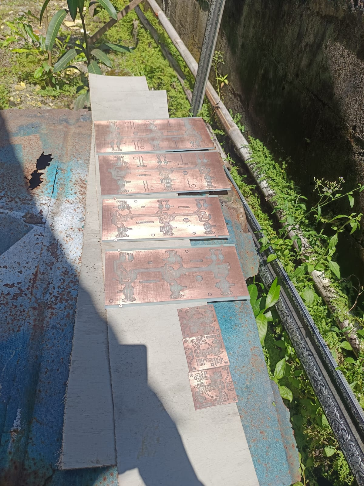

# Jam Digital NTP 6-Digit (High Precision)

Proyek jam digital berbasis mikrokontroler yang mengambil data waktu dari server NTP melalui koneksi kabel (Ethernet) untuk stabilitas maksimum. Menampilkan waktu dalam format **HH:MM:SS** menggunakan 7-segment besar dengan sistem driver shift register 4094.

---

## 📺 Demo Video & Dokumentasi Visual

Berikut adalah dokumentasi operasional perangkat:

### Video Operasional
[](https://www.youtube.com/watch?v=_R5s3KsJ4hs)
*Klik gambar di atas untuk memutar video demo.*

### Foto Perangkat

*Gambar 1: Unit display jam 6 digit industrial.*

---

### Foto PCB

*Gambar 2: PCB 7 segment 4 inch dan 5 inch.*

---

## 🌟 Fitur Utama
* **Koneksi LAN (Ethernet)**: Menggunakan modul W5500 untuk konektivitas jaringan yang sangat stabil.
* **Akurasi Tinggi**: Sinkronisasi otomatis ke server NTP (`id.pool.ntp.org`).
* **Driver 4094**: Menggunakan IC Shift Register 4094 untuk kendali display 6-digit.
* **Tampilan 6-Digit**: Format Jam, Menit, dan Detik (HH:MM:SS).

## 🛠️ Komponen Utama
1. **Mikrokontroler**: Wemos D1 Mini (ESP8266).
2. **Modul Ethernet**: Wiznet W5500 (Komunikasi SPI).
3. **Display Driver**: IC 4094 (Shift Register).
4. **Display**: 6-Digit LED 7-Segment ukuran besar.

---

## 🔌 Konfigurasi Pin

### 1. Wemos D1 Mini ke W5500 (SPI)
| W5500 | Wemos D1 Mini | Deskripsi |
| :--- | :--- | :--- |
| **VCC** | 3.3V | Power |
| **GND** | GND | Ground |
| **SCS (SS)** | D2 (GPIO4) | Chip Select |
| **MOSI** | D7 (GPIO13) | Master Out Slave In |
| **MISO** | D6 (GPIO12) | Master In Slave Out |
| **SCLK** | D5 (GPIO14) | Clock |

### 2. Wemos D1 Mini ke Driver 4094
| Driver 4094 | Wemos D1 Mini | Deskripsi |
| :--- | :--- | :--- |
| **DATA** | D1 (GPIO5) | Data Input |
| **STR (Strobe)** | D3 (GPIO0) | Latch/Strobe |
| **CLK (Clock)** | D4 (GPIO2) | Shift Clock |

---

## 🚀 Instalasi Library
Pastikan library berikut terinstal di Arduino IDE:
* `Ethernet` (by Arduino) - Mendukung chip W5500.
* `NTPClient` (by Fabrice Weinberg).

## 💻 Contoh Implementasi Kode (Snippet)
```cpp
#include <SPI.h>
#include <Ethernet.h>
#include <NTPClient.h>
#include <EthernetUdp.h>

byte mac[] = { 0xDE, 0xAD, 0xBE, 0xEF, 0xFE, 0xED };
EthernetUDP ntpUDP;
NTPClient timeClient(ntpUDP, "id.pool.ntp.org", 25200); // Offset WIB (+7)

#include <SPI.h>
#include <Ethernet2.h>
#include <EthernetUdp2.h>
#include <Wire.h>
#include <Adafruit_GFX.h>
#include <Adafruit_SSD1306.h>

#define SCREEN_WIDTH 128
#define SCREEN_HEIGHT 32
Adafruit_SSD1306 display(SCREEN_WIDTH, SCREEN_HEIGHT, &Wire, -1);

// ======= Ubah nomor unit 1-30 =======
#define MY_UNIT 2
// =====================================

// MAC unik: ubah byte terakhir sesuai unit
byte mac[] = {0xDE, 0xAD, 0xBE, 0xEF, 0x00, MY_UNIT};

// IP statis sesuai subnet Raspberry (192.168.0.x)
IPAddress ip(192,168,10,100 + MY_UNIT);  // Unit 1 → 192.168.0.101

// UDP settings
unsigned int localPort = 8888;
EthernetUDP Udp;
char packetBuffer[32];

void setup() {
  Serial.begin(115200);
  delay(1000);

  // OLED
  if(!display.begin(SSD1306_SWITCHCAPVCC, 0x3C)){
    Serial.println("Gagal deteksi OLED!");
    for(;;);
  }
  display.clearDisplay();
  display.setTextSize(2);
  display.setTextColor(SSD1306_WHITE);
  display.setCursor(0,0);
  display.println("Init...");
  display.display();

  // Ethernet2
  Ethernet.init(D4);  // CS W5500 Lite di D4
  Ethernet.begin(mac, ip); // IP statis
  delay(1000);

  Serial.print("Unit ");
  Serial.print(MY_UNIT);
  Serial.print(" Wemos IP: ");
  Serial.println(Ethernet.localIP());

  // Mulai UDP
  Udp.begin(localPort);
  Serial.print("UDP listening on port ");
  Serial.println(localPort);

  display.clearDisplay();
  display.setCursor(0,0);
  display.println("Ready");
  display.display();
}

void loop() {
  int packetSize = Udp.parsePacket();
  if(packetSize) {
    int len = Udp.read(packetBuffer, 32);
    if(len > 0) packetBuffer[len] = 0; // null terminate

    Serial.print("Received: ");
    Serial.println(packetBuffer);

    display.clearDisplay();
    display.setCursor(0,0);
    display.println(packetBuffer); // hh:mm:ss
    display.display();
  }
}

